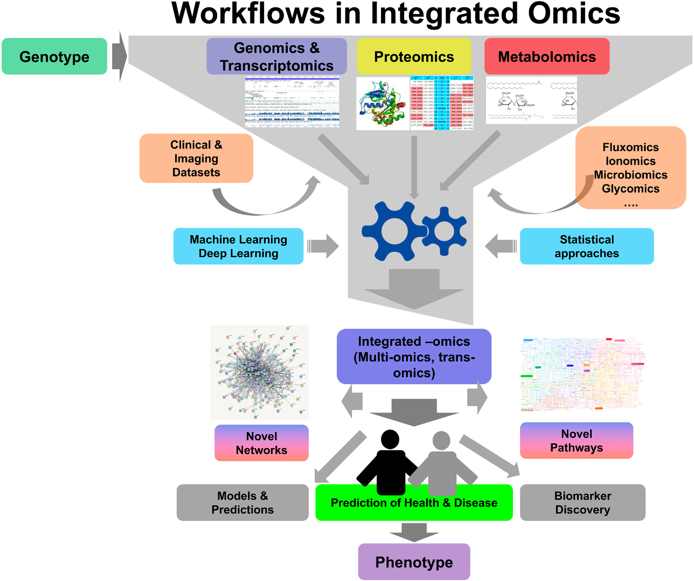
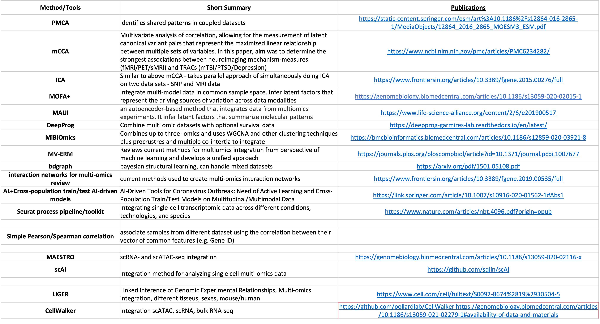
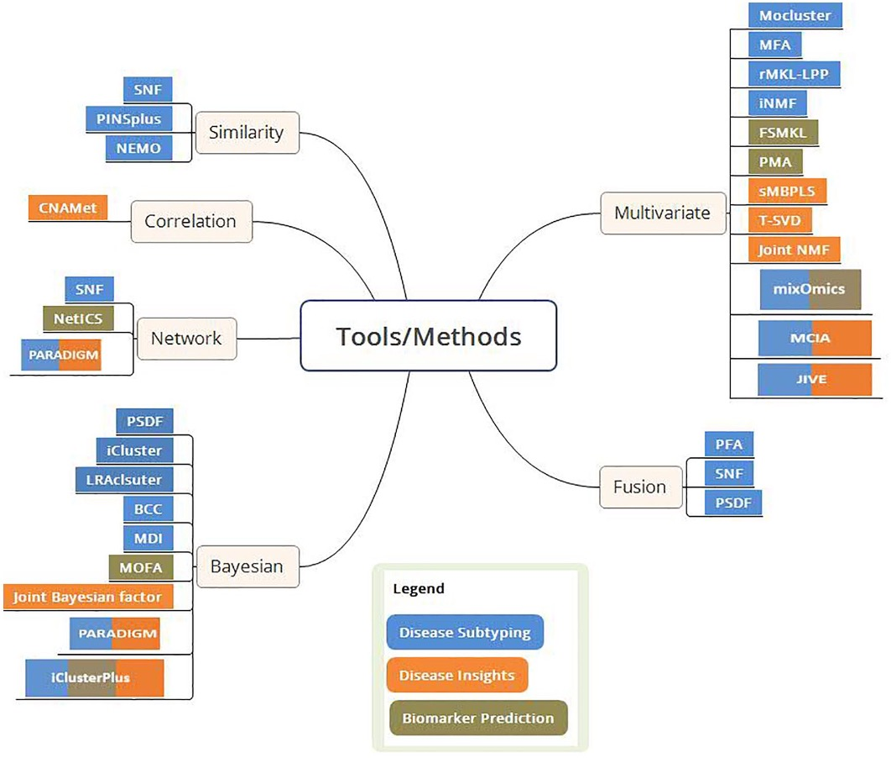
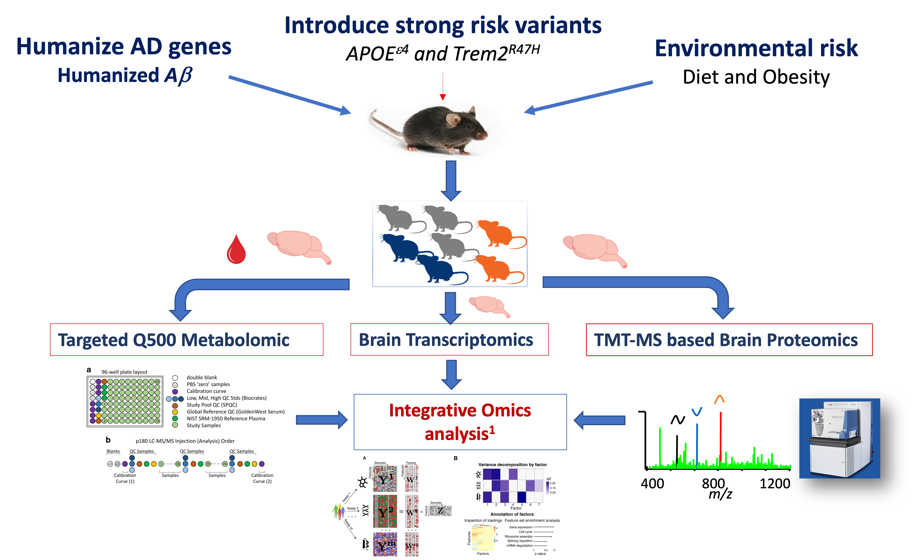
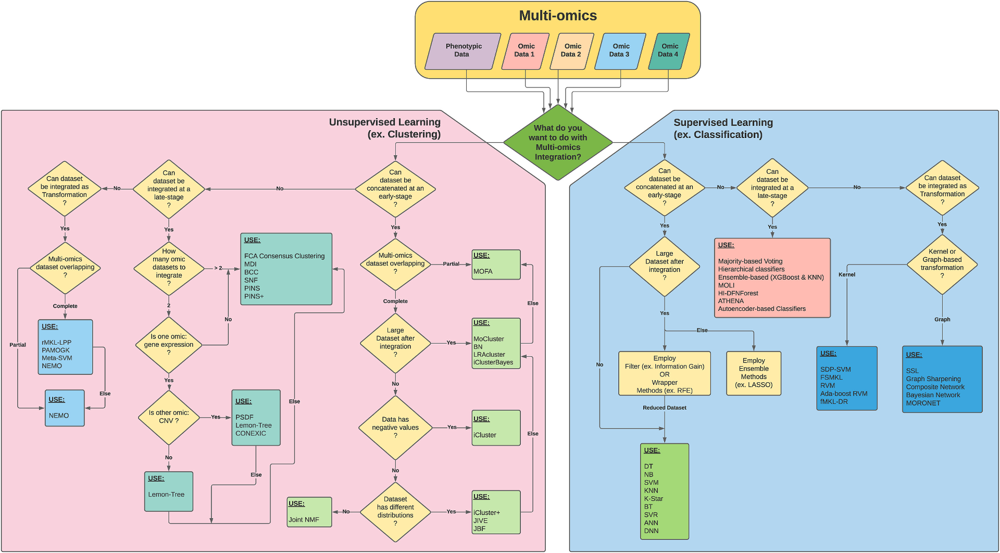

Integrative Multi-Omics Analysis
================
2025-03-23

Author: Ravi Pandey, Jackson Laboratory

# Introduction

Alzheimer’s disease is a complex, multifactorial pathology with high
heterogeneity in biological alternations.One of the biggest challenges
in AD is to identify pathways and markers of disease progression, which
can be easily accessible, in asymptomatic at-risk individuals.
Multi-omics data could provide complementary information, which might be
helpful to reveal the underlying biology of the associations. Moreover,
integrating the information from single-omics studies provides an
opportunity for a thorough exploration of endophenotype networks and
biological interactions related to disease.



(source: <https://pubmed.ncbi.nlm.nih.gov/30006342/>)

## Challenges in multi-omics analysis

- Heterogeneity, Sparsity and outliers
- Omics datasets can differ vastly in size (number of features)
- More features than data (p \>\> n)
- Class imbalance and overfitting
- Computation and storage cost
- Additionally, biological datasets are complex, noisy, with potential
  errors due to measurement mistakes or unique biological deviations.

## Methods/Tools



One can choose tools based on its ability to address biological question
of interests and approaches.

### The biological questions are broadly categorized into 3 different case studies:

- Disease subtyping and classification based on multi-omics profiles.

- Prediction of biomarkers for various applications including
  diagnostics and driver genes for diseases.

- Deriving insights into disease biology.



(source: [Subramanian I et
al.2020](https://pmc.ncbi.nlm.nih.gov/articles/PMC7003173/))

In this lesson, we are going to integrate data from multiple omics
platforms (transcriptomics, proteomics, and metabolomics) in an unbiased
fashion, considering interaction between modalities using **multi-omics
factor analysis (MOFA)**.

## Overview of MOFA (multi-omics factor analysis)

[MOFA](https://biofam.github.io/MOFA2/) is a factor analysis model that
provides a general framework for the integration of multi-omic data sets
in an unsupervised fashion. Intuitively, MOFA can be viewed as a
versatile and statistically rigorous generalization of principal
component analysis to multi-omics data. Given several data matrices with
measurements of multiple -omics data types on the same or on overlapping
sets of samples, MOFA infers an interpretable low-dimensional
representation in terms of a few latent factors. These learnt factors
represent the driving sources of variation across data modalities, thus
facilitating the identification of cellular states or disease subgroups.
[MOFA2](https://biofam.github.io/MOFA2/NEWS.html)


## Multi-Omics Data

For this lesson, we are going to use multi-omics data from [LOAD2 mice
cohort](https://www.synapse.org/Synapse:syn51534997). LOAD2 mice cohort
consist of mouse models expressing humanized Abeta and two genetic risk
factors (APOE4 and Trem2\*R47H) at multiple ages for both sexes. The
data are being released as part of [MODEL-AD (Model Organism Development
& Evaluation for Late-Onset Alzheimer’s
Disease)](https://www.model-ad.org) consortium. We conducted brain RNA
sequencing, TMT-based brain proteomics, and targeted metabolomics in
both brain and plasma samples from over a hundred mice.



**Let’s start …**

### Load Libraries

``` r
library("MOFA2")
library("MOFAdata")
library("AnnotationDbi")
library("MultiAssayExperiment")
library(tidyverse)
library(dplyr)
library(data.table)
library(ggplot2)
library(purrr)
library(cowplot)
library(reticulate)
library(gt)
#library(synapser)
```

### Synapse Download

You can download the data from Synapse data repository. API clients
provide a way to use Synapse programmatically. Installation instructions
are available at [Synapse API Documentation
Site](https://help.synapse.org/docs/Installing-Synapse-API-Clients.1985249668.html).

The Synapse command line client is implemented in Python and comes with
the Synapse Python package. To install the Synapse command line client,
make sure that you have Python and pip installed. For more information,
see the [Python](https://www.python.org/downloads/) and
[pip](https://pip.pypa.io/en/stable/installing/) installation
instructions.

``` bash
pip install synapseclient
synapse login -u SYNAPSEUSER -p SYNAPSE_AUTH_TOKEN
synapse -h

# example:download single file
synapse get syn34114003 --version 2

# download multiple files together
synapse get-download-list
```

``` r
# Proteomics
synapse get syn33605372 --version 2

df.protein <- read.csv("data/TMT_normAbundances_Batch_regressed_Jax.IU.Pitt_LOAD2.csv") %>% dplyr::select(-"specimenID") %>% column_to_rownames(.,var="individualID")

# Brain metabolomics
synapse get syn34114003

df.brainmet <- read.csv("data/Q500-brain_5833_Jax.IU.Pitt_LOAD2.csv")[,c(1:2,6:248)] %>% select(-"specimenID") %>% column_to_rownames(.,var="individualID")

# Plasma metabolomics 
synapse get syn34114002

df.plasmamet <- read.csv("data/Q500-plasma_5833_Jax.IU.Pitt_LOAD2.csv")[,c(1:2,6:459)] 

# Transcriptomics 
synapse get syn26195571

df.rna <- read.delim2("data/rnaseq_rsem.merged.gene_counts_Jax.IU.Pitt_LOAD2.tsv",check.names = F) %>% dplyr::select(-"transcript_id(s)") %>% column_to_rownames("gene_id")
```

We need to re-process the data to prepare it for input into MOFA. After
re-processing, you can store data in a list format like below and can be
inputted to MOFA.

``` r
AD_data <- list("Brain.Trans"= as.matrix(df.rna.norm),"PlasmaMeta"= as.matrix(df.plasmamet),"BrainMeta"= as.matrix(df.brainmet),"Proteins"= as.matrix(df.protein))
saveRDS(AD_data,file="data/AD_OmicsData.rds")
```

We’ll skip this step for now, but you can complete it in your free time.
We’ll be using the processed data and metadata for integrative analysis.

### Load data

``` r
AD_data <- readRDS("data/AD_OmicsData.rds")
lapply(AD_data, dim) 
```

    ## $Brain.Trans
    ## [1] 19878   106
    ## 
    ## $PlasmaMeta
    ## [1] 454 105
    ## 
    ## $BrainMeta
    ## [1] 243 106
    ## 
    ## $Proteins
    ## [1] 8602  106

Let’s check the data

``` r
AD_data$Brain.Trans[1:5,1:8]
```

    ##          50130    50316    50323    50389    50394    50395    51003    51007
    ## Gnai3 3.382053 3.407262 3.399493 3.414759 3.423258 3.410657 3.425562 3.416852
    ## Cdc45 2.840115 2.862579 2.850313 2.861727 2.846612 2.870444 2.878602 2.899075
    ## H19   2.786492 2.729832 2.746410 2.773358 2.809781 2.700492 2.702488 2.738903
    ## Scml2 2.891104 2.856333 2.815852 2.894488 2.885750 2.883277 2.875253 2.814438
    ## Apoh  2.729897 2.733669 2.703876 2.685259 2.729252 2.709516 2.699244 2.747691

``` r
AD_data$Proteins[1:5,1:8]
```

    ##                      50130       50316        50323        50389        50394
    ## Dync1h1.Q9JHU4  0.03593564  0.06332429 -0.028716182  0.069717972  0.000371381
    ## Sptan1.B9EKJ1  -0.01621585 -0.04678289  0.003484264 -0.025884450  0.042879525
    ## Sptan1.E9Q447   0.04036904 -0.06265565  0.114494945  0.152829910 -0.065677761
    ## Sptan1.B7ZWK3  -0.02807768 -0.08684510 -0.028227685 -0.003363745  0.030999364
    ## Ank2.Q8C8R3.2  -0.02666336 -0.03879798  0.009258663 -0.033007445  0.044784192
    ##                       50395       51003        51007
    ## Dync1h1.Q9JHU4 -0.006129719  0.03589722  0.001746378
    ## Sptan1.B9EKJ1   0.017133969 -0.06152933 -0.020950508
    ## Sptan1.E9Q447   0.212985616  0.16678477 -0.004633678
    ## Sptan1.B7ZWK3   0.027687324 -0.10505185 -0.037864239
    ## Ank2.Q8C8R3.2   0.035806980 -0.04287130  0.059415673

``` r
AD_data$PlasmaMeta[1:5,1:8]
```

    ##                      50130      50316      50323      50389      50394
    ## C0             4.773192040  4.7227381  5.1494215  4.9496897  5.0672718
    ## C2             3.782306844  4.0666836  4.2304026  4.0752836  3.8881590
    ## C3            -0.693605707 -0.3551559 -0.7073895 -0.5356703 -0.9493844
    ## C3.DC..C4.OH. -3.075408776 -2.3855597 -2.5899819 -2.3312477 -2.4073752
    ## C4             0.001051582  0.4977249  0.5294306  0.7924650  1.1846088
    ##                    50395      51003      51007
    ## C0             5.1212723  4.1466576  4.6358948
    ## C2             4.3667201  2.9239377  3.3212564
    ## C3             0.2624915 -1.2431486 -1.5094841
    ## C3.DC..C4.OH. -1.7204870 -3.2793603 -3.3123107
    ## C4             1.5563730  0.7464116 -0.4079952

``` r
AD_data$BrainMeta[1:5,1:8]
```

    ##                   50130     50316     50323     50389     50394     50395
    ## C0             3.628861  3.491175  3.335184  3.777141  3.492472  3.434089
    ## C2             2.019508  2.462707  1.593381  1.962925  2.414993  2.282543
    ## C3            -3.767542 -2.194707 -4.131880 -4.894299 -3.344102 -2.280190
    ## C3.DC..C4.OH. -3.898077 -3.511717 -4.602416 -3.952525 -4.250866 -3.678960
    ## C4            -3.859741 -2.535561 -4.089066 -4.503175 -3.315805 -2.932323
    ##                   51003     51007
    ## C0             2.908451  3.137472
    ## C2             1.742815  1.927878
    ## C3            -3.079559 -3.237546
    ## C3.DC..C4.OH. -3.874287 -4.102768
    ## C4            -2.811956 -3.256912

### Load metadata

``` r
AD_covariates <- readRDS("data/metadata.rds")
dim(AD_covariates)
```

    ## [1] 106   4

Let’s check the metadata

``` r
head(AD_covariates)
```

    ##          Sex Age Genotype Diet
    ## 50130 Female   4    LOAD1   CD
    ## 50316 Female  18    LOAD1   CD
    ## 50323   Male  12    LOAD1   CD
    ## 50389 Female  18    LOAD2   CD
    ## 50394   Male  18    LOAD2   CD
    ## 50395   Male  18    LOAD1   CD

``` r
dplyr::count(AD_covariates, Sex, Genotype, Age,Diet)  %>% gt() 
```

<div id="qwuikqhxng" style="padding-left:0px;padding-right:0px;padding-top:10px;padding-bottom:10px;overflow-x:auto;overflow-y:auto;width:auto;height:auto;">
<style>#qwuikqhxng table {
  font-family: system-ui, 'Segoe UI', Roboto, Helvetica, Arial, sans-serif, 'Apple Color Emoji', 'Segoe UI Emoji', 'Segoe UI Symbol', 'Noto Color Emoji';
  -webkit-font-smoothing: antialiased;
  -moz-osx-font-smoothing: grayscale;
}
&#10;#qwuikqhxng thead, #qwuikqhxng tbody, #qwuikqhxng tfoot, #qwuikqhxng tr, #qwuikqhxng td, #qwuikqhxng th {
  border-style: none;
}
&#10;#qwuikqhxng p {
  margin: 0;
  padding: 0;
}
&#10;#qwuikqhxng .gt_table {
  display: table;
  border-collapse: collapse;
  line-height: normal;
  margin-left: auto;
  margin-right: auto;
  color: #333333;
  font-size: 16px;
  font-weight: normal;
  font-style: normal;
  background-color: #FFFFFF;
  width: auto;
  border-top-style: solid;
  border-top-width: 2px;
  border-top-color: #A8A8A8;
  border-right-style: none;
  border-right-width: 2px;
  border-right-color: #D3D3D3;
  border-bottom-style: solid;
  border-bottom-width: 2px;
  border-bottom-color: #A8A8A8;
  border-left-style: none;
  border-left-width: 2px;
  border-left-color: #D3D3D3;
}
&#10;#qwuikqhxng .gt_caption {
  padding-top: 4px;
  padding-bottom: 4px;
}
&#10;#qwuikqhxng .gt_title {
  color: #333333;
  font-size: 125%;
  font-weight: initial;
  padding-top: 4px;
  padding-bottom: 4px;
  padding-left: 5px;
  padding-right: 5px;
  border-bottom-color: #FFFFFF;
  border-bottom-width: 0;
}
&#10;#qwuikqhxng .gt_subtitle {
  color: #333333;
  font-size: 85%;
  font-weight: initial;
  padding-top: 3px;
  padding-bottom: 5px;
  padding-left: 5px;
  padding-right: 5px;
  border-top-color: #FFFFFF;
  border-top-width: 0;
}
&#10;#qwuikqhxng .gt_heading {
  background-color: #FFFFFF;
  text-align: center;
  border-bottom-color: #FFFFFF;
  border-left-style: none;
  border-left-width: 1px;
  border-left-color: #D3D3D3;
  border-right-style: none;
  border-right-width: 1px;
  border-right-color: #D3D3D3;
}
&#10;#qwuikqhxng .gt_bottom_border {
  border-bottom-style: solid;
  border-bottom-width: 2px;
  border-bottom-color: #D3D3D3;
}
&#10;#qwuikqhxng .gt_col_headings {
  border-top-style: solid;
  border-top-width: 2px;
  border-top-color: #D3D3D3;
  border-bottom-style: solid;
  border-bottom-width: 2px;
  border-bottom-color: #D3D3D3;
  border-left-style: none;
  border-left-width: 1px;
  border-left-color: #D3D3D3;
  border-right-style: none;
  border-right-width: 1px;
  border-right-color: #D3D3D3;
}
&#10;#qwuikqhxng .gt_col_heading {
  color: #333333;
  background-color: #FFFFFF;
  font-size: 100%;
  font-weight: normal;
  text-transform: inherit;
  border-left-style: none;
  border-left-width: 1px;
  border-left-color: #D3D3D3;
  border-right-style: none;
  border-right-width: 1px;
  border-right-color: #D3D3D3;
  vertical-align: bottom;
  padding-top: 5px;
  padding-bottom: 6px;
  padding-left: 5px;
  padding-right: 5px;
  overflow-x: hidden;
}
&#10;#qwuikqhxng .gt_column_spanner_outer {
  color: #333333;
  background-color: #FFFFFF;
  font-size: 100%;
  font-weight: normal;
  text-transform: inherit;
  padding-top: 0;
  padding-bottom: 0;
  padding-left: 4px;
  padding-right: 4px;
}
&#10;#qwuikqhxng .gt_column_spanner_outer:first-child {
  padding-left: 0;
}
&#10;#qwuikqhxng .gt_column_spanner_outer:last-child {
  padding-right: 0;
}
&#10;#qwuikqhxng .gt_column_spanner {
  border-bottom-style: solid;
  border-bottom-width: 2px;
  border-bottom-color: #D3D3D3;
  vertical-align: bottom;
  padding-top: 5px;
  padding-bottom: 5px;
  overflow-x: hidden;
  display: inline-block;
  width: 100%;
}
&#10;#qwuikqhxng .gt_spanner_row {
  border-bottom-style: hidden;
}
&#10;#qwuikqhxng .gt_group_heading {
  padding-top: 8px;
  padding-bottom: 8px;
  padding-left: 5px;
  padding-right: 5px;
  color: #333333;
  background-color: #FFFFFF;
  font-size: 100%;
  font-weight: initial;
  text-transform: inherit;
  border-top-style: solid;
  border-top-width: 2px;
  border-top-color: #D3D3D3;
  border-bottom-style: solid;
  border-bottom-width: 2px;
  border-bottom-color: #D3D3D3;
  border-left-style: none;
  border-left-width: 1px;
  border-left-color: #D3D3D3;
  border-right-style: none;
  border-right-width: 1px;
  border-right-color: #D3D3D3;
  vertical-align: middle;
  text-align: left;
}
&#10;#qwuikqhxng .gt_empty_group_heading {
  padding: 0.5px;
  color: #333333;
  background-color: #FFFFFF;
  font-size: 100%;
  font-weight: initial;
  border-top-style: solid;
  border-top-width: 2px;
  border-top-color: #D3D3D3;
  border-bottom-style: solid;
  border-bottom-width: 2px;
  border-bottom-color: #D3D3D3;
  vertical-align: middle;
}
&#10;#qwuikqhxng .gt_from_md > :first-child {
  margin-top: 0;
}
&#10;#qwuikqhxng .gt_from_md > :last-child {
  margin-bottom: 0;
}
&#10;#qwuikqhxng .gt_row {
  padding-top: 8px;
  padding-bottom: 8px;
  padding-left: 5px;
  padding-right: 5px;
  margin: 10px;
  border-top-style: solid;
  border-top-width: 1px;
  border-top-color: #D3D3D3;
  border-left-style: none;
  border-left-width: 1px;
  border-left-color: #D3D3D3;
  border-right-style: none;
  border-right-width: 1px;
  border-right-color: #D3D3D3;
  vertical-align: middle;
  overflow-x: hidden;
}
&#10;#qwuikqhxng .gt_stub {
  color: #333333;
  background-color: #FFFFFF;
  font-size: 100%;
  font-weight: initial;
  text-transform: inherit;
  border-right-style: solid;
  border-right-width: 2px;
  border-right-color: #D3D3D3;
  padding-left: 5px;
  padding-right: 5px;
}
&#10;#qwuikqhxng .gt_stub_row_group {
  color: #333333;
  background-color: #FFFFFF;
  font-size: 100%;
  font-weight: initial;
  text-transform: inherit;
  border-right-style: solid;
  border-right-width: 2px;
  border-right-color: #D3D3D3;
  padding-left: 5px;
  padding-right: 5px;
  vertical-align: top;
}
&#10;#qwuikqhxng .gt_row_group_first td {
  border-top-width: 2px;
}
&#10;#qwuikqhxng .gt_row_group_first th {
  border-top-width: 2px;
}
&#10;#qwuikqhxng .gt_summary_row {
  color: #333333;
  background-color: #FFFFFF;
  text-transform: inherit;
  padding-top: 8px;
  padding-bottom: 8px;
  padding-left: 5px;
  padding-right: 5px;
}
&#10;#qwuikqhxng .gt_first_summary_row {
  border-top-style: solid;
  border-top-color: #D3D3D3;
}
&#10;#qwuikqhxng .gt_first_summary_row.thick {
  border-top-width: 2px;
}
&#10;#qwuikqhxng .gt_last_summary_row {
  padding-top: 8px;
  padding-bottom: 8px;
  padding-left: 5px;
  padding-right: 5px;
  border-bottom-style: solid;
  border-bottom-width: 2px;
  border-bottom-color: #D3D3D3;
}
&#10;#qwuikqhxng .gt_grand_summary_row {
  color: #333333;
  background-color: #FFFFFF;
  text-transform: inherit;
  padding-top: 8px;
  padding-bottom: 8px;
  padding-left: 5px;
  padding-right: 5px;
}
&#10;#qwuikqhxng .gt_first_grand_summary_row {
  padding-top: 8px;
  padding-bottom: 8px;
  padding-left: 5px;
  padding-right: 5px;
  border-top-style: double;
  border-top-width: 6px;
  border-top-color: #D3D3D3;
}
&#10;#qwuikqhxng .gt_last_grand_summary_row_top {
  padding-top: 8px;
  padding-bottom: 8px;
  padding-left: 5px;
  padding-right: 5px;
  border-bottom-style: double;
  border-bottom-width: 6px;
  border-bottom-color: #D3D3D3;
}
&#10;#qwuikqhxng .gt_striped {
  background-color: rgba(128, 128, 128, 0.05);
}
&#10;#qwuikqhxng .gt_table_body {
  border-top-style: solid;
  border-top-width: 2px;
  border-top-color: #D3D3D3;
  border-bottom-style: solid;
  border-bottom-width: 2px;
  border-bottom-color: #D3D3D3;
}
&#10;#qwuikqhxng .gt_footnotes {
  color: #333333;
  background-color: #FFFFFF;
  border-bottom-style: none;
  border-bottom-width: 2px;
  border-bottom-color: #D3D3D3;
  border-left-style: none;
  border-left-width: 2px;
  border-left-color: #D3D3D3;
  border-right-style: none;
  border-right-width: 2px;
  border-right-color: #D3D3D3;
}
&#10;#qwuikqhxng .gt_footnote {
  margin: 0px;
  font-size: 90%;
  padding-top: 4px;
  padding-bottom: 4px;
  padding-left: 5px;
  padding-right: 5px;
}
&#10;#qwuikqhxng .gt_sourcenotes {
  color: #333333;
  background-color: #FFFFFF;
  border-bottom-style: none;
  border-bottom-width: 2px;
  border-bottom-color: #D3D3D3;
  border-left-style: none;
  border-left-width: 2px;
  border-left-color: #D3D3D3;
  border-right-style: none;
  border-right-width: 2px;
  border-right-color: #D3D3D3;
}
&#10;#qwuikqhxng .gt_sourcenote {
  font-size: 90%;
  padding-top: 4px;
  padding-bottom: 4px;
  padding-left: 5px;
  padding-right: 5px;
}
&#10;#qwuikqhxng .gt_left {
  text-align: left;
}
&#10;#qwuikqhxng .gt_center {
  text-align: center;
}
&#10;#qwuikqhxng .gt_right {
  text-align: right;
  font-variant-numeric: tabular-nums;
}
&#10;#qwuikqhxng .gt_font_normal {
  font-weight: normal;
}
&#10;#qwuikqhxng .gt_font_bold {
  font-weight: bold;
}
&#10;#qwuikqhxng .gt_font_italic {
  font-style: italic;
}
&#10;#qwuikqhxng .gt_super {
  font-size: 65%;
}
&#10;#qwuikqhxng .gt_footnote_marks {
  font-size: 75%;
  vertical-align: 0.4em;
  position: initial;
}
&#10;#qwuikqhxng .gt_asterisk {
  font-size: 100%;
  vertical-align: 0;
}
&#10;#qwuikqhxng .gt_indent_1 {
  text-indent: 5px;
}
&#10;#qwuikqhxng .gt_indent_2 {
  text-indent: 10px;
}
&#10;#qwuikqhxng .gt_indent_3 {
  text-indent: 15px;
}
&#10;#qwuikqhxng .gt_indent_4 {
  text-indent: 20px;
}
&#10;#qwuikqhxng .gt_indent_5 {
  text-indent: 25px;
}
&#10;#qwuikqhxng .katex-display {
  display: inline-flex !important;
  margin-bottom: 0.75em !important;
}
&#10;#qwuikqhxng div.Reactable > div.rt-table > div.rt-thead > div.rt-tr.rt-tr-group-header > div.rt-th-group:after {
  height: 0px !important;
}
</style>
<table class="gt_table" data-quarto-disable-processing="false" data-quarto-bootstrap="false">
  <thead>
    <tr class="gt_col_headings">
      <th class="gt_col_heading gt_columns_bottom_border gt_center" rowspan="1" colspan="1" scope="col" id="Sex">Sex</th>
      <th class="gt_col_heading gt_columns_bottom_border gt_center" rowspan="1" colspan="1" scope="col" id="Genotype">Genotype</th>
      <th class="gt_col_heading gt_columns_bottom_border gt_center" rowspan="1" colspan="1" scope="col" id="Age">Age</th>
      <th class="gt_col_heading gt_columns_bottom_border gt_center" rowspan="1" colspan="1" scope="col" id="Diet">Diet</th>
      <th class="gt_col_heading gt_columns_bottom_border gt_right" rowspan="1" colspan="1" scope="col" id="n">n</th>
    </tr>
  </thead>
  <tbody class="gt_table_body">
    <tr><td headers="Sex" class="gt_row gt_center">Female</td>
<td headers="Genotype" class="gt_row gt_center">B6</td>
<td headers="Age" class="gt_row gt_center">18</td>
<td headers="Diet" class="gt_row gt_center">CD</td>
<td headers="n" class="gt_row gt_right">6</td></tr>
    <tr><td headers="Sex" class="gt_row gt_center">Female</td>
<td headers="Genotype" class="gt_row gt_center">LOAD1</td>
<td headers="Age" class="gt_row gt_center">4</td>
<td headers="Diet" class="gt_row gt_center">CD</td>
<td headers="n" class="gt_row gt_right">6</td></tr>
    <tr><td headers="Sex" class="gt_row gt_center">Female</td>
<td headers="Genotype" class="gt_row gt_center">LOAD1</td>
<td headers="Age" class="gt_row gt_center">12</td>
<td headers="Diet" class="gt_row gt_center">CD</td>
<td headers="n" class="gt_row gt_right">6</td></tr>
    <tr><td headers="Sex" class="gt_row gt_center">Female</td>
<td headers="Genotype" class="gt_row gt_center">LOAD1</td>
<td headers="Age" class="gt_row gt_center">18</td>
<td headers="Diet" class="gt_row gt_center">CD</td>
<td headers="n" class="gt_row gt_right">6</td></tr>
    <tr><td headers="Sex" class="gt_row gt_center">Female</td>
<td headers="Genotype" class="gt_row gt_center">LOAD1</td>
<td headers="Age" class="gt_row gt_center">18</td>
<td headers="Diet" class="gt_row gt_center">HFD</td>
<td headers="n" class="gt_row gt_right">6</td></tr>
    <tr><td headers="Sex" class="gt_row gt_center">Female</td>
<td headers="Genotype" class="gt_row gt_center">LOAD2</td>
<td headers="Age" class="gt_row gt_center">4</td>
<td headers="Diet" class="gt_row gt_center">CD</td>
<td headers="n" class="gt_row gt_right">6</td></tr>
    <tr><td headers="Sex" class="gt_row gt_center">Female</td>
<td headers="Genotype" class="gt_row gt_center">LOAD2</td>
<td headers="Age" class="gt_row gt_center">12</td>
<td headers="Diet" class="gt_row gt_center">CD</td>
<td headers="n" class="gt_row gt_right">6</td></tr>
    <tr><td headers="Sex" class="gt_row gt_center">Female</td>
<td headers="Genotype" class="gt_row gt_center">LOAD2</td>
<td headers="Age" class="gt_row gt_center">18</td>
<td headers="Diet" class="gt_row gt_center">CD</td>
<td headers="n" class="gt_row gt_right">6</td></tr>
    <tr><td headers="Sex" class="gt_row gt_center">Female</td>
<td headers="Genotype" class="gt_row gt_center">LOAD2</td>
<td headers="Age" class="gt_row gt_center">18</td>
<td headers="Diet" class="gt_row gt_center">HFD</td>
<td headers="n" class="gt_row gt_right">6</td></tr>
    <tr><td headers="Sex" class="gt_row gt_center">Male</td>
<td headers="Genotype" class="gt_row gt_center">B6</td>
<td headers="Age" class="gt_row gt_center">18</td>
<td headers="Diet" class="gt_row gt_center">CD</td>
<td headers="n" class="gt_row gt_right">6</td></tr>
    <tr><td headers="Sex" class="gt_row gt_center">Male</td>
<td headers="Genotype" class="gt_row gt_center">LOAD1</td>
<td headers="Age" class="gt_row gt_center">4</td>
<td headers="Diet" class="gt_row gt_center">CD</td>
<td headers="n" class="gt_row gt_right">4</td></tr>
    <tr><td headers="Sex" class="gt_row gt_center">Male</td>
<td headers="Genotype" class="gt_row gt_center">LOAD1</td>
<td headers="Age" class="gt_row gt_center">12</td>
<td headers="Diet" class="gt_row gt_center">CD</td>
<td headers="n" class="gt_row gt_right">6</td></tr>
    <tr><td headers="Sex" class="gt_row gt_center">Male</td>
<td headers="Genotype" class="gt_row gt_center">LOAD1</td>
<td headers="Age" class="gt_row gt_center">18</td>
<td headers="Diet" class="gt_row gt_center">CD</td>
<td headers="n" class="gt_row gt_right">6</td></tr>
    <tr><td headers="Sex" class="gt_row gt_center">Male</td>
<td headers="Genotype" class="gt_row gt_center">LOAD1</td>
<td headers="Age" class="gt_row gt_center">18</td>
<td headers="Diet" class="gt_row gt_center">HFD</td>
<td headers="n" class="gt_row gt_right">5</td></tr>
    <tr><td headers="Sex" class="gt_row gt_center">Male</td>
<td headers="Genotype" class="gt_row gt_center">LOAD2</td>
<td headers="Age" class="gt_row gt_center">4</td>
<td headers="Diet" class="gt_row gt_center">CD</td>
<td headers="n" class="gt_row gt_right">7</td></tr>
    <tr><td headers="Sex" class="gt_row gt_center">Male</td>
<td headers="Genotype" class="gt_row gt_center">LOAD2</td>
<td headers="Age" class="gt_row gt_center">12</td>
<td headers="Diet" class="gt_row gt_center">CD</td>
<td headers="n" class="gt_row gt_right">6</td></tr>
    <tr><td headers="Sex" class="gt_row gt_center">Male</td>
<td headers="Genotype" class="gt_row gt_center">LOAD2</td>
<td headers="Age" class="gt_row gt_center">18</td>
<td headers="Diet" class="gt_row gt_center">CD</td>
<td headers="n" class="gt_row gt_right">6</td></tr>
    <tr><td headers="Sex" class="gt_row gt_center">Male</td>
<td headers="Genotype" class="gt_row gt_center">LOAD2</td>
<td headers="Age" class="gt_row gt_center">18</td>
<td headers="Diet" class="gt_row gt_center">HFD</td>
<td headers="n" class="gt_row gt_right">6</td></tr>
  </tbody>
  &#10;  
</table>
</div>

This table tells you all age group, sex, genotype, diet and how many
samples are in each group.

### Create MOFA object

``` r
# Create MultiAssayExperiment object 
mae_AD <- MultiAssayExperiment(
  experiments = AD_data,
  colData = AD_covariates)

# Create MOFA object ##
model <- create_mofa(mae_AD)
model
```

### Build and Train Object

This step can take upto 15-20 minutes. We’ll skip this step for now, but
you can complete it later.

``` r
## Define options ##
##data options
data_opts <- get_default_data_options(model)
data_opts

#Define model options
model_opts <- get_default_model_options(model)
model_opts$num_factors <- 10
model_opts

#Define training options
train_opts <- get_default_training_options(model)
train_opts$convergence_mode <- "slow"
train_opts$seed <- 1111
train_opts

## Prepare MOFA object ##
model <- prepare_mofa(model,
  data_options = data_opts,
  model_options = model_opts,
  training_options = train_opts
)

## Train the model ##
model <- run_mofa(model,use_basilisk = TRUE)

## Save the model ##
saveRDS(model,"data/MOFA2_Object_10factor.rds")
#micromamba activate /Users/pandera/Library/Caches/org.R-project.R/R/basilisk/1.18.0/0
```

### Load trained model

We will load the trained model and explore the MOFA object for
downstream analyses.

``` r
MOFAobject <- readRDS("data/MOFA2_Object_15factor.rds")
MOFAobject
```

    ## Trained MOFA with the following characteristics: 
    ##  Number of views: 4 
    ##  Views names: Brain.Trans PlasmaMeta BrainMeta Proteins 
    ##  Number of features (per view): 19878 454 243 8602 
    ##  Number of groups: 1 
    ##  Groups names: group1 
    ##  Number of samples (per group): 106 
    ##  Number of factors: 15

### Overview of the data

The function `plot_data_overview` can be used to obtain an overview of
the input data. It shows how many views (rows) and how many groups
(columns) exist, what are their corresponding dimensionalities and how
many missing information they have (grey bars).

``` r
plot_data_overview(MOFAobject)
```


### Add metadata to the model

The metadata is stored as a data.frame object in
`model@samples_metadata`, and it requires at least the column sample.
The number of rows must match the total number of samples in the model.

``` r
head(AD_covariates)
```

    ##          Sex Age Genotype Diet
    ## 50130 Female   4    LOAD1   CD
    ## 50316 Female  18    LOAD1   CD
    ## 50323   Male  12    LOAD1   CD
    ## 50389 Female  18    LOAD2   CD
    ## 50394   Male  18    LOAD2   CD
    ## 50395   Male  18    LOAD1   CD

``` r
AD_covariates$sample <- rownames(AD_covariates)
samples_metadata(MOFAobject) <- AD_covariates
head(MOFAobject@samples_metadata, n=5)
```

    ##          Sex Age Genotype Diet sample  group
    ## 50130 Female   4    LOAD1   CD  50130 group1
    ## 50316 Female  18    LOAD1   CD  50316 group1
    ## 50323   Male  12    LOAD1   CD  50323 group1
    ## 50389 Female  18    LOAD2   CD  50389 group1
    ## 50394   Male  18    LOAD2   CD  50394 group1

### Variance decomposition

The first step in the MOFA analysis is to quantify the amount of
variance explained (𝑅^2) by each factor in each data modality. The
variance explained estimates are stored in the hdf5 file and loaded in
`MOFAobject@cache[["variance_explained"]]`:

##### Total variance explained per view and group

``` r
MOFAobject@cache$variance_explained$r2_total[[1]]
```

    ## Brain.Trans  PlasmaMeta   BrainMeta    Proteins 
    ##    42.76213    66.47333    32.57267    43.03760

Let’s plot variance explained estimates:

``` r
plot_variance_explained(MOFAobject , x="view", y="factor")
```


#### Renaming dimensions

The user can rename the dimensions of the model as follows:

``` r
views_names(MOFAobject)
```

    ## [1] "Brain.Trans" "PlasmaMeta"  "BrainMeta"   "Proteins"

``` r
views_names(MOFAobject) <- c("Transcriptomics", "Plasma Metabolomics","Brain Metabolomics","Proteomics")
views_names(MOFAobject)
```

    ## [1] "Transcriptomics"     "Plasma Metabolomics" "Brain Metabolomics" 
    ## [4] "Proteomics"

``` r
factors_names(MOFAobject)
```

    ##  [1] "Factor1"  "Factor2"  "Factor3"  "Factor4"  "Factor5"  "Factor6" 
    ##  [7] "Factor7"  "Factor8"  "Factor9"  "Factor10" "Factor11" "Factor12"
    ## [13] "Factor13" "Factor14" "Factor15"

``` r
factors_names(MOFAobject) <- paste0("LF",c(1:15))
factors_names(MOFAobject)
```

    ##  [1] "LF1"  "LF2"  "LF3"  "LF4"  "LF5"  "LF6"  "LF7"  "LF8"  "LF9"  "LF10"
    ## [11] "LF11" "LF12" "LF13" "LF14" "LF15"

``` r
plot_variance_explained(MOFAobject)
```


##### Variance explained for every factor in per view and group

``` r
MOFAobject@cache$variance_explained$r2_per_factor[[1]]
```

    ##      Transcriptomics Plasma Metabolomics Brain Metabolomics   Proteomics
    ## LF1     1.107528e-04        45.023971719        0.001599441 1.056614e-04
    ## LF2     2.388946e-04         0.103648409        2.401866961 2.124522e+01
    ## LF3     1.620314e+01         0.002631586        2.610556945 5.607056e-03
    ## LF4     1.993100e-01         7.611620670        8.371110022 2.543883e+00
    ## LF5     3.985905e+00         1.319170924        7.694674229 3.404121e+00
    ## LF6     8.252737e-05         0.001617342        0.223916448 1.102318e+01
    ## LF7     7.127392e-01         2.802452460        5.609232985 1.299765e+00
    ## LF8     1.943470e+00         4.649598197        2.356880180 1.943161e-01
    ## LF9     4.464782e-01         6.106694043        0.768684349 1.788879e+00
    ## LF10    8.252979e+00         0.026071594        0.772557042 1.652078e-02
    ## LF11    4.867525e+00         0.196413618        0.001227749 2.043101e-04
    ## LF12    3.136182e+00         0.192051373        0.090483299 5.067614e-03
    ## LF13    2.615062e+00         0.197868079        0.557388585 1.853962e-02
    ## LF14    8.827759e-04         0.276999158        0.260847252 2.569058e+00
    ## LF15    1.454285e+00         0.012322165        0.001368526 8.209902e-05

``` r
#Total variance explained per view
plot_variance_explained(MOFAobject, plot_total = T)[[2]]
```


##### Correlation between factors

We can also visualize correlation between factors

``` r
#Correlation between factors
plot_factor_cor(MOFAobject)
```


### Association between MOFA factors and Co-variates

``` r
correlate_factors_with_covariates(MOFAobject, 
                                  covariates = c("Genotype","Sex","Diet","Age"), 
                                  plot=c("log_pval","r")
)
```


### Visualisation of samples in the latent space

Each MOFA factor captures a different dimension of heterogeneity in the
data. Mathematically, each factor ordinates cells along a
one-dimensional axis centered at zero. Samples with different signs
manifest opposite phenotypes along the inferred axis of variation, with
higher absolute value indicating a stronger effect. Note that the
interpretation of factors is analogous to the interpretation of the
principal components in PCA.

Factors can be plotted using plot_factor (for beeswarm plots of
individual factors) or plot_factors (for scatter plots of factor
combinations).

``` r
plot_factor(MOFAobject, 
            factors = 5, 
            color_by = "Age",
            group_by = "Genotype",shape_by = "Diet",
            dodge = TRUE,
            add_violin = TRUE
)
```


``` r
plot_factor(MOFAobject, 
            factors = 9, 
            color_by = "Sex",
            group_by = "Genotype",shape_by = "Age",
            dodge = TRUE,
            add_violin = TRUE
)
```


### Visualisation of feature weights

The weights provide a score for how strong each feature relates to each
factor. Features with no association with the factor have values close
to zero, while features with strong association with the factor have
large absolute values. The sign of the weight indicates the direction of
the effect: a positive weight indicates that the feature has higher
levels in the cells with positive factor values, and vice versa.

Weights can be plotted using `plot_weights` (beeswarm plots) or
`plot_top_weights` (scatter plots).

``` r
plot_top_weights(MOFAobject,
                 view = "Transcriptomics",
                 factors = 5,
                 nfeatures = 10,     # Top number of features to highlight
                 scale = T,           # Scale weights from -1 to 1
                 abs = F
)
```


``` r
plot_weights(MOFAobject,
                 view = "Transcriptomics",
                 factor = 5,
                 nfeatures = 10,     # Top number of features to highlight
                 scale = T           # Scale weights from -1 to 1
)
```


Similarly, we can identify top proteins and metabolites associated with
eah factor

``` r
plot_top_weights(MOFAobject,
                       view = "Proteomics",
                       factors = 5,
                       nfeatures = 10,     # Top number of features to highlight
                       scale = T,           # Scale weights from -1 to 1
                        abs = F
)
```


``` r
##Plot feature weights for Brain metabolite 
plot_top_weights(MOFAobject,
             view = "Plasma Metabolomics",
             factors = 5,
             nfeatures = 10,     # Top number of features to highlight
             scale = T,           # Scale weights from -1 to 1
             abs = F
)
```


``` r
plot_top_weights(MOFAobject,
                 view = "Brain Metabolomics",
                 factors = 5,
                 nfeatures = 10,     # Top number of features to highlight
                 scale = T ,           # Scale weights from -1 to 1
                  abs = F
)
```


### Visualisation of patterns in the input data

Instead of looking at weights, it is useful to observe the coordinated
heterogeneity that MOFA captures in the original data. This can be done
using the plot_data_heatmap and plot_data_scatter function.

#### Heatmaps

Heatmap of observations. Top features are selected by its weight in the
selected factor. By default, samples are ordered according to their
corresponding factor value.

``` r
plot_data_heatmap(MOFAobject,
  view = "Transcriptomics",         # view of interest
  factor = 5,             # factor of interest
  features = 20,          # number of features to plot (they are selected by weight)
  
  # extra arguments that are passed to the `pheatmap` function
  cluster_rows = TRUE, cluster_cols = FALSE,
  show_rownames = TRUE, show_colnames = FALSE
)
```


#### Scatter plot

Scatter plots of observations vs factor values. It is useful to add a
linear regression estimate to visualise if the relationship between
(top) features and factor values is linear.

``` r
plot_data_scatter(MOFAobject,
  view = "Transcriptomics",         # view of interest
  factor = 5,             # factor of interest
  features = 9,           # number of features to plot (they are selected by weight)
  add_lm = TRUE,          # add linear regression
  color_by = "Age"
)
```


``` r
plot_data_scatter(MOFAobject,
  view = "Proteomics",         # view of interest
  factor = 5,             # factor of interest
  features = 9,           # number of features to plot (they are selected by weight)
  add_lm = TRUE,          # add linear regression
  color_by = "Age"
)
```


``` r
plot_data_scatter(MOFAobject,
  view = "Brain Metabolomics",         # view of interest
  factor = 5,             # factor of interest
  features = 9,           # number of features to plot (they are selected by weight)
  add_lm = TRUE,          # add linear regression
  color_by = "Age"
)
```


``` r
plot_data_scatter(MOFAobject,
  view = "Plasma Metabolomics",         # view of interest
  factor = 5,             # factor of interest
  features = 9,           # number of features to plot (they are selected by weight)
  add_lm = TRUE,          # add linear regression
  color_by = "Age"
)
```


#### Scatter plot by directionality

``` r
## we can also sepearte by sign
plot_data_scatter(MOFAobject,
  view = "Transcriptomics",         # view of interest
  factor = 5,             # factor of interest
  features = 9,           # number of features to plot (they are selected by weight)
  add_lm = TRUE,# add linear regression
  sign = "positive",
  color_by = "Age"
)
```


``` r
plot_data_scatter(MOFAobject,
  view = "Transcriptomics",         # view of interest
  factor = 5,             # factor of interest
  features = 9,           # number of features to plot (they are selected by weight)
  add_lm = TRUE,# add linear regression
  sign = "negative",
  color_by = "Age"
)
```


#### Plot specific features

``` r
plot_data_scatter(MOFAobject, 
                  view = "Transcriptomics",
                  factor = 5,  
                  features = "C4b",
                  color_by = "Age",
)
```

<!-- -->

### Gene Set Enrichment Analysis (GSEA)

#### Gene set annotations

There are a large number of gene set annotations, and the right one to
use will depend on your data set. Some generic and commonly used ones
are [MSigDB](https://www.gsea-msigdb.org/gsea/msigdb/index.jsp),
[Reactome](https://reactome.org/) and [Gene
Ontology](http://geneontology.org/). There are some manually processed
some gene sets, which can be found in the [MOFAdata
package](https://bioconductor.org/packages/release/data/experiment/html/MOFAdata.html).

Test datasets used in this workshop are from mouse models, so we are
going to use mouse gene set annotations MSigDB 6.0 (mouse) from MOFAdata
package:

``` r
# C2: curated gene sets from online pathway databases, publications in PubMed, and knowledge of domain experts.
data("MSigDB_v6.0_C2_mouse") 


head(rownames(MSigDB_v6.0_C2_mouse), n=3)
```

    ## [1] "KEGG_GLYCOLYSIS_GLUCONEOGENESIS" "KEGG_CITRATE_CYCLE_TCA_CYCLE"   
    ## [3] "KEGG_PENTOSE_PHOSPHATE_PATHWAY"

``` r
head(colnames(MSigDB_v6.0_C2_mouse), n=3)
```

    ## [1] "XKR4"  "RP1"   "SOX17"

``` r
# C5: extracted from the Gene Ontology data.base
data("MSigDB_v6.0_C5_mouse") 

head(rownames(MSigDB_v6.0_C5_mouse), n=3)
```

    ## [1] "GO_POSITIVE_REGULATION_OF_VIRAL_TRANSCRIPTION"           
    ## [2] "GO_CARDIAC_CHAMBER_DEVELOPMENT"                          
    ## [3] "GO_DNA_DEPENDENT_DNA_REPLICATION_MAINTENANCE_OF_FIDELITY"

``` r
head(colnames(MSigDB_v6.0_C5_mouse), n=3)
```

    ## [1] "XKR4"  "RP1"   "SOX17"

Give them a shot, but it is likely that you will have to create a
tailored gene set for your application. Also, If you have an annotation
that other people could benefit from, please let us know and we will
upload it.

For this example we will use the MSigDB_v6.0_C5_mouse gene set
annotations, which are derived from the Gene Ontology data base. First,
we need to match the gene names in the MOFA object to the gene names in
the gene set annotation. For this we just have to capitalise the gene
names in MOFA:

``` r
model <- MOFAobject
features_names(model)[["Transcriptomics"]] <- toupper(features_names(model)[["Transcriptomics"]])
head(features_names(model)[["Transcriptomics"]])
```

    ## [1] "GNAI3" "CDC45" "H19"   "SCML2" "APOH"  "NARF"

#### Run enrichment analysis

An important consideration when running GSEA is that MOFA has positive
and negative weights. The features with positive weights are “high” in
the samples with positive factor values, whereas the features with
negative weights are “high” in the samples with negative factor values.
Taking this into account, you may want to do GSEA specifically with the
positive weights or with the negative weights. Merging them and taking
the absolute value could dilute the signal. Hence, do GSEA separately
for (+) and (-) weights as well as jointly with all weights.

As a demonstration, we will run GSEA with a simple parametric t-test
using features with poitive and negative weights.

it can take upto 4-5 minutes

``` r
enrichment.parametric.pos <- run_enrichment(model,
                                            view = "Transcriptomics", 
                                            factors = 1:10,
                                            feature.sets = MSigDB_v6.0_C5_mouse,
                                            sign = "positive",
                                            statistical.test = "parametric"
)

enrichment.parametric.neg <- run_enrichment(model,
                                            view = "Transcriptomics", 
                                            factors = 1:10,
                                            feature.sets = MSigDB_v6.0_C5_mouse,
                                            sign = "negative",
                                            statistical.test = "parametric"
)
```

The enrichment analysis returns a list of 5 elements:

- **feature.sets**: the feature set matrix filtered by the genes that
  overlap with the MOFA model.
- **pval**: the nominal p-values.
- **pval.adj**: the FDR-adjusted p-values.
- **feature.statistics**: the feature statistics (i.e. the weights).
- **set.statistics**: matrices with the gene set statistics.
- **sigPathways**: list with significant pathways per factor at a
  specified FDR threshold

Let’s explore the output:

``` r
names(enrichment.parametric.pos)
```

    ## [1] "feature.sets"       "pval"               "pval.adj"          
    ## [4] "feature.statistics" "set.statistics"     "sigPathways"

``` r
enrichment.parametric.pos$pval.adj[1:5,1]
```

    ##            GO_POSITIVE_REGULATION_OF_VIRAL_TRANSCRIPTION 
    ##                                                1.0000000 
    ##                           GO_CARDIAC_CHAMBER_DEVELOPMENT 
    ##                                                0.9999395 
    ## GO_DNA_DEPENDENT_DNA_REPLICATION_MAINTENANCE_OF_FIDELITY 
    ##                                                1.0000000 
    ##                                      GO_CIRCADIAN_RHYTHM 
    ##                                                0.9999395 
    ##              GO_PHOSPHATIDYLSERINE_ACYL_CHAIN_REMODELING 
    ##                                                1.0000000

### Plot results of enrichment analysis

There are three main functions to plot the results of the gene set
enrichment analysis:

- **plot_enrichment_heatmap**: plot a heatmap of gene sets (rows) versus
  factors (columns) where each entry correspons to the log p-value. This
  is useful to get an overview on which factors show statistically
  enriched pathways.
- **plot_enrichment**: plot the top significant pathways for a specific
  factor.
- **plot_enrichment_detailed**: plot a detailed output, highlighting the
  genes that are contributing to the enrichment of each pathway.

``` r
plot_enrichment(enrichment.parametric.pos, 
  factor = 5, 
  max.pathways = 15
)
```


The lineplot shows that features with positive weights for Factor 5 is
enriched for immune-associated processed, that’s implies that
immune-related genes are highly expressed in the samples with positive
factor values i.e. in aged mice.

``` r
plot_enrichment(enrichment.parametric.neg, 
                factor = 5, 
                max.pathways = 15
)
```


The lineplot shows that features with negative weights for Factor 5 is
enriched for synapse/neuron related biological processed, that’s implies
that synapse genes have reduced expression in the samples with positive
factor values i.e. in aged mice.

``` r
plot_enrichment_detailed(enrichment.parametric.pos, 
                         factor = 5, 
                         max.genes = 8, 
                         max.pathways = 5
)
```


This plot shows that all enriched pathways are driven by the
immune-related genes. The results above suggest that complement genes
are highly expressed in samples with positive factor values.

``` r
plot_enrichment_detailed(enrichment.parametric.neg, 
                         factor = 5, 
                         max.genes = 8, 
                         max.pathways = 5
)
```


#### Run enrichment analysis for protein data

``` r
x1 <- features_names(model)[["Proteomics"]] 
x2 <- sapply(x1, function(x) unlist(strsplit(x, split = "[.]"))[1])

features_names(model)[["Proteomics"]] <- toupper(x2)
head(features_names(model)[["Proteomics"]])
```

    ## [1] "DYNC1H1" "SPTAN1"  "SPTAN1"  "SPTAN1"  "ANK2"    "ANK2"

``` r
enrichment.parametric.pos.protein <- run_enrichment(model,
                                            view = "Proteomics", 
                                            factors = 1:10,
                                            feature.sets = MSigDB_v6.0_C5_mouse,
                                            sign = "positive",
                                            statistical.test = "parametric"
)

enrichment.parametric.neg.protein <- run_enrichment(model,
                                                    view = "Proteomics", 
                                                    factors = 1:10,
                                                    feature.sets = MSigDB_v6.0_C5_mouse,
                                                    sign = "negative",
                                                    statistical.test = "parametric"
)
```

``` r
plot_enrichment(enrichment.parametric.pos.protein, 
                factor = 5, 
                max.pathways = 15
)
```

<!-- -->

``` r
plot_enrichment(enrichment.parametric.neg.protein, 
                factor = 5, 
                max.pathways = 15
)
```

<!-- -->

``` r
plot_enrichment_detailed(enrichment.parametric.pos.protein, 
                         factor = 5, 
                         max.genes = 8, 
                         max.pathways = 10
)
```

<!-- -->

``` r
plot_enrichment_detailed(enrichment.parametric.neg.protein, 
                         factor = 5, 
                         max.genes = 8, 
                         max.pathways = 5
)
```

<!-- -->

### Extracting data for downstream analysis

We can extract the feature weights, the data and the factors to generate
their own plots.

Extract factors

``` r
factors <- get_factors(MOFAobject, 
                       factors = "all", 
                       as.data.frame = T
)
head(factors)
```

    ##   sample factor       value  group
    ## 1  50130    LF1 -0.07046337 group1
    ## 2  50316    LF1  0.45690942 group1
    ## 3  50323    LF1 -0.19301024 group1
    ## 4  50389    LF1 -0.90989785 group1
    ## 5  50394    LF1 -0.27807130 group1
    ## 6  50395    LF1  0.10562172 group1

Extract weights

``` r
weights <- get_weights(MOFAobject, 
                       views = "all", 
                       factors = "all", 
                       as.data.frame = T, 
)
head(weights)
```

    ##   feature factor         value            view
    ## 1   Gnai3    LF1  5.228105e-09 Transcriptomics
    ## 2   Cdc45    LF1  8.720307e-09 Transcriptomics
    ## 3     H19    LF1 -6.445765e-08 Transcriptomics
    ## 4   Scml2    LF1  5.079806e-09 Transcriptomics
    ## 5    Apoh    LF1  1.982940e-08 Transcriptomics
    ## 6    Narf    LF1 -8.508424e-10 Transcriptomics

Extract data

``` r
# data <- get_data(MOFAobject, 
#                  views = "all", 
#                  as.data.frame = T
# )
# head(data)
```

#### Top plasma metabolites positively associated with factor 5

``` r
weights %>% filter(view %in% "Plasma Metabolomics") %>%  filter(value > 0.6 & factor %in% "LF5") %>% pull("feature") %>% as.character(.)
```

    ##  [1] "C14_PlasmaMeta"                "C16_PlasmaMeta"               
    ##  [3] "C16.1_PlasmaMeta"              "C18.1_PlasmaMeta"             
    ##  [5] "C18.1.OH_PlasmaMeta"           "CE.20.3."                     
    ##  [7] "CE.20.4."                      "HexCer.d18.1.18.0._PlasmaMeta"
    ##  [9] "TG.16.0_32.1."                 "TG.16.0_34.1."                
    ## [11] "TG.16.0_34.2."                 "TG.16.0_34.3."                
    ## [13] "TG.16.0_36.2."                 "TG.16.0_36.3."                
    ## [15] "TG.16.1_32.0."                 "TG.16.1_32.1."                
    ## [17] "TG.16.1_34.0."                 "TG.16.1_34.1."                
    ## [19] "TG.16.1_34.2."                 "TG.16.1_34.3."                
    ## [21] "TG.16.1_36.1."                 "TG.16.1_36.2."                
    ## [23] "TG.16.1_36.3."                 "TG.16.1_36.4."                
    ## [25] "TG.17.2_36.4."                 "TG.17.2_38.5."                
    ## [27] "TG.17.2_38.6."                 "TG.18.1_32.1."                
    ## [29] "TG.18.1_32.2."                 "TG.18.1_34.1."                
    ## [31] "TG.18.1_34.2."                 "TG.18.1_34.3."                
    ## [33] "TG.18.1_36.1."                 "TG.18.1_36.2."                
    ## [35] "TG.18.1_36.3."                 "TG.18.2_32.1."                
    ## [37] "TG.18.2_34.1."                 "TG.20.1_32.3."                
    ## [39] "TG.20.4_34.1."                 "X1.Met.His_PlasmaMeta"

## Recommendation flowchart for choosing a method for multi-omics integration from \[Reel et al. 2021\] (<https://pubmed.ncbi.nlm.nih.gov/33794304/>)



``` r
sessionInfo()
```

    ## R version 4.4.2 (2024-10-31)
    ## Platform: aarch64-apple-darwin20
    ## Running under: macOS Ventura 13.7.4
    ## 
    ## Matrix products: default
    ## BLAS:   /Library/Frameworks/R.framework/Versions/4.4-arm64/Resources/lib/libRblas.0.dylib 
    ## LAPACK: /Library/Frameworks/R.framework/Versions/4.4-arm64/Resources/lib/libRlapack.dylib;  LAPACK version 3.12.0
    ## 
    ## locale:
    ## [1] en_US.UTF-8/en_US.UTF-8/en_US.UTF-8/C/en_US.UTF-8/en_US.UTF-8
    ## 
    ## time zone: America/New_York
    ## tzcode source: internal
    ## 
    ## attached base packages:
    ## [1] stats4    stats     graphics  grDevices utils     datasets  methods  
    ## [8] base     
    ## 
    ## other attached packages:
    ##  [1] gt_0.11.1                   reticulate_1.39.0          
    ##  [3] cowplot_1.1.3               data.table_1.16.2          
    ##  [5] lubridate_1.9.3             forcats_1.0.0              
    ##  [7] stringr_1.5.1               dplyr_1.1.4                
    ##  [9] purrr_1.0.2                 readr_2.1.5                
    ## [11] tidyr_1.3.1                 tibble_3.2.1               
    ## [13] ggplot2_3.5.1               tidyverse_2.0.0            
    ## [15] MultiAssayExperiment_1.32.0 SummarizedExperiment_1.36.0
    ## [17] GenomicRanges_1.58.0        GenomeInfoDb_1.42.0        
    ## [19] MatrixGenerics_1.18.0       matrixStats_1.4.1          
    ## [21] AnnotationDbi_1.67.0        IRanges_2.40.0             
    ## [23] S4Vectors_0.44.0            Biobase_2.66.0             
    ## [25] BiocGenerics_0.52.0         MOFAdata_1.22.0            
    ## [27] MOFA2_1.16.0               
    ## 
    ## loaded via a namespace (and not attached):
    ##  [1] mnormt_2.1.1            DBI_1.2.3               rlang_1.1.4            
    ##  [4] magrittr_2.0.3          compiler_4.4.2          RSQLite_2.3.7          
    ##  [7] mgcv_1.9-1              dir.expiry_1.14.0       png_0.1-8              
    ## [10] vctrs_0.6.5             reshape2_1.4.4          pkgconfig_2.0.3        
    ## [13] crayon_1.5.3            fastmap_1.2.0           backports_1.5.0        
    ## [16] XVector_0.46.0          labeling_0.4.3          utf8_1.2.4             
    ## [19] rmarkdown_2.29          tzdb_0.4.0              UCSC.utils_1.2.0       
    ## [22] bit_4.5.0               xfun_0.49               zlibbioc_1.52.0        
    ## [25] cachem_1.1.0            jsonlite_1.8.9          blob_1.2.4             
    ## [28] highr_0.11              rhdf5filters_1.18.0     DelayedArray_0.32.0    
    ## [31] Rhdf5lib_1.28.0         psych_2.4.6.26          broom_1.0.7            
    ## [34] parallel_4.4.2          R6_2.5.1                stringi_1.8.4          
    ## [37] RColorBrewer_1.1-3      car_3.1-3               Rcpp_1.0.13-1          
    ## [40] knitr_1.48              splines_4.4.2           Matrix_1.7-1           
    ## [43] timechange_0.3.0        tidyselect_1.2.1        rstudioapi_0.17.1      
    ## [46] abind_1.4-8             yaml_2.3.10             lattice_0.22-6         
    ## [49] plyr_1.8.9              basilisk.utils_1.18.0   withr_3.0.2            
    ## [52] KEGGREST_1.46.0         evaluate_1.0.1          Rtsne_0.17             
    ## [55] xml2_1.3.6              Biostrings_2.74.0       ggpubr_0.6.0           
    ## [58] pillar_1.9.0            filelock_1.0.3          carData_3.0-5          
    ## [61] corrplot_0.95           generics_0.1.3          hms_1.1.3              
    ## [64] munsell_0.5.1           scales_1.3.0            glue_1.8.0             
    ## [67] pheatmap_1.0.12         tools_4.4.2             ggsignif_0.6.4         
    ## [70] rhdf5_2.50.0            grid_4.4.2              colorspace_2.1-1       
    ## [73] nlme_3.1-166            GenomeInfoDbData_1.2.13 basilisk_1.18.0        
    ## [76] HDF5Array_1.34.0        Formula_1.2-5           cli_3.6.3              
    ## [79] fansi_1.0.6             S4Arrays_1.6.0          uwot_0.2.2             
    ## [82] gtable_0.3.6            rstatix_0.7.2           sass_0.4.9             
    ## [85] digest_0.6.37           SparseArray_1.6.0       ggrepel_0.9.6          
    ## [88] farver_2.1.2            memoise_2.0.1           htmltools_0.5.8.1      
    ## [91] lifecycle_1.0.4         httr_1.4.7              bit64_4.5.2
